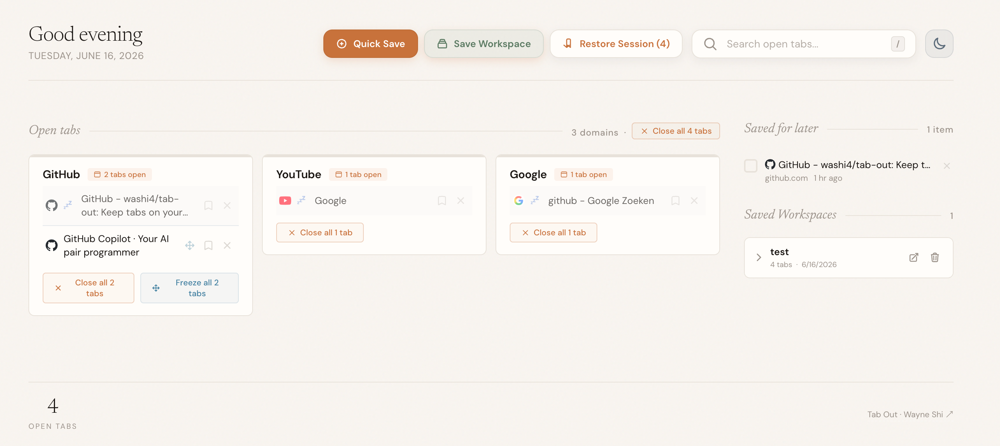

# Tab Out

> **Keep tabs on your tabs.**

[](https://github.com/washi4/tab-out)
[](https://github.com/washi4/tab-out)
[](https://github.com/washi4/tab-out)
[](./LICENSE)

Tab Out is a Chromium extension that replaces your default new tab page with a beautiful, responsive dashboard of everything you have open. Tabs are grouped cleanly by domain, with essential homepages (Gmail, X, LinkedIn, GitHub, etc.) elegantly isolated at the top. Close tabs with a satisfying physics-based swoosh and dynamic confetti bursts.

**No servers. No tracking. No accounts. 100% offline.**



Originally based on the open-source Tab Out project by Zara Zhang and adapted here as a personal customized build under the MIT License.

---

## Install with a coding agent

Send your coding agent (Claude Code, Codex, etc.) this repo and say **"install this"**:

```
https://github.com/washi4/tab-out
```

The agent will walk you through it. Takes about 1 minute.

---

## Features

- **Domain Grouping & Homepages** — See all your open tabs grouped by domain. Crucial landing pages (Gmail, X, YouTube, GitHub, etc.) are elegantly isolated at the top.
- **Tab Sleep & RAM Saver (💤/❄️)** — Spot frozen tabs instantly by their breathing sleep badges. Unload resource-heavy pages with one click or via keyboard, accompanied by a crystalline freeze chime.
- **Workspace Session Manager** — Group selected open tabs into distinct, named custom workspaces. Restore, manage, or delete them in the right sidebar.
- **Keyboard Maestro (Vim Style)** — Mouse-free master navigation! Select tabs with `Tab`/`Shift-Tab`, Vim `j`/`k`, or Arrows, then hit `Enter` to focus, `d` to close, `s` to save, or `f` to freeze.
- **Autocomplete Command Palette** — Press `/` to focus the search bar, filter open tabs instantly, and use keyboard arrows to jump to them.
- **Global Quick Search Popup & Shortcut** — Tap `Alt+Shift+T` (or `⌥⇧T` on Mac) on *any* web page to instantly summon a clean floating search popup. View your open tabs grouped by domain/localhost port, close tabs instantly with hover scale-up buttons, and navigate entirely with your keyboard (Arrows, Tab, Enter)!
- **Theme Switcher** — Seamlessly toggle between "Sage Paper" (warm organic light mode) and "Cyber Deck" (matrix cyberpunk dark mode), complete with distinct synthesizer sweeps and matching confetti bursts.
- **Local Profile Customizer** — Click your avatar in the left-top corner to instantly change your name and select from beautiful pixel emojis, featuring tactile Web Audio arpeggio feedback.
- **Pixel Tab Pet Companion** — Mochi the Cat (Sage Green) or Byte the Robot (Cyber Deck) lives on your tab, reacting to your page cleanups, saves, and profile edits with cute animations and speech bubbles.
- **100% Local & Private** — Pure extension structure with zero server setup or external trackers. Your data never leaves your machine.

---

## Manual Setup

**1. Clone the repo**

```bash
git clone https://github.com/washi4/tab-out.git
```

**2. Load the extension in Chrome or Edge**

1. Open Chrome and go to `chrome://extensions` or open Edge and go to `edge://extensions`
2. Enable **Developer mode** (top-right toggle)
3. Click **Load unpacked**
4. Navigate to the `extension/` folder inside the cloned repo and select it

**3. Open a new tab**

You'll see Tab Out.

---

## Customizing Shortcuts

Tab Out comes with `Alt+Shift+T` (or `⌥⇧T` on Mac) as the default global shortcut to summon the search popup from *any* page. You can easily customize this keybinding to your liking:

1. Open Chrome and navigate to `chrome://extensions/shortcuts` (or Edge and go to `edge://extensions/shortcuts`).
2. Scroll down to find **Tab Out**.
3. Click inside the input field next to **"Activate the extension"** (or click the edit pencil icon).
4. Press your preferred key combination (e.g., `Ctrl+Shift+Space`, `Alt+O`, etc.).
5. Select **"Global"** instead of "In Chrome" if you want to summon your tab-search panel even when your browser is in the background!

---

## How it works

```
[ Open a New Tab ]
        │
        ▼
┌──────────────────────────────────────┐
│  Tab Out groups open tabs by domain  │
├──────────────────────────────────────┤
│  Homepages isolated inside top card  │
└──────────────────┬───────────────────┘
                   │
         ┌─────────┴─────────┐
         ▼                   ▼
┌──────────────────┐   ┌──────────────────┐
│  Click tab title │   │  Close card/tabs │
│   to focus/jump  │   │ (swoosh+confetti)│
└──────────────────┘   └──────────────────┘
```

Everything runs inside the extension. No external server, no API calls, no data sent anywhere. Saved tabs are stored in `chrome.storage.local`.

---

## Tech stack

| What | How |
|------|-----|
| Extension | Chrome Manifest V3 |
| Storage | `chrome.storage.local` (100% Offline) |
| Sound | Web Audio API (real-time synthesis, 0 files) |
| Animations | Native CSS keyframes + physics-based confetti particles |

---

## License

MIT
